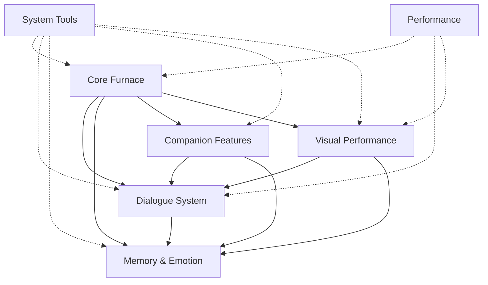

# Marionet 功能索引

> 快速导航和功能概览

---

## 阅读指南

本目录包含 Marionet 的详细功能设计文档。每个文档聚焦一个核心领域，可独立阅读。

**推荐阅读顺序**：
1. 先阅读本索引了解整体架构
2. 根据需要深入阅读具体模块
3. 查看交叉引用了解模块间关系

---

## 核心设计理念

Marionet 基于 **"感知 → 决策 → 表现"** 统一框架：

```
┌─────────────┐
│  感知层      │ 捕获环境上下文
│ Perception  │
└──────┬──────┘
       ↓
┌─────────────┐
│  决策层      │ 判断行为时机
│  Decision   │
└──────┬──────┘
       ↓
┌─────────────┐
│  表现层      │ 视觉与语音输出
│ Performance │
└─────────────┘
```

**设计原则**：
- **离线优先** - 核心功能本地化，AI 为增强层
- **有机融合** - 统一框架，避免功能割裂
- **低侵入高温度** - 智能择机，专注模式静默
- **模块化可扩展** - 插件式架构，按需加载

---

## 功能模块导航

### [核心系统 (Core Furnace)](./core-furnace.md)

系统的"大脑"，负责感知、决策和调度。

**核心组件**：
- **Perception Unit** - 环境感知（键鼠、窗口、音频、视觉）
- **Decision Unit** - 行为决策（时机判断、模式切换、行为学习）
- **Arbitration Unit** - 请求仲裁（优先级处理、冲突解决）
- **Control Dispatcher** - 行为调度（Action/Task 二层系统）

**关键特性**：
- 环境感知的结构化输出
- 模拟人生式行为系统（大任务 + 小任务）
- 活跃/礼貌模式切换
- 行为学习与自适应
- 可解释的决策理由

**适合阅读对象**：架构设计者、核心开发者

---

### [对话系统](./dialogue-system.md)

自然流畅的对话能力，支持文字和语音交互。

**核心机制**：
- **Fast/Slow 双通道** - 快速响应 + 深度回复
- **Chat Core** - 上下文管理、角色人格、情绪状态
- **TTS** - 语音合成、口型同步、情绪表达

**技术亮点**：
- Fast < 300ms，Slow 流式输出
- 情绪驱动的语气调整
- 断句优化与口型同步
- 智能缓存常用回复

**适合阅读对象**：对话系统开发者

---

### [记忆与情感](./memory-emotion.md)

让陪伴者"记住"和"感受"。

**记忆系统**：
- **短期记忆** - 当前会话上下文
- **长期记忆** - 用户偏好、重要事件（图数据库）
- **事实记忆** - 可编辑的结构化知识
- **行为模式** - 时间/活动偏好学习

**情感系统**：
- **好感度** (0-100) - 影响台词和互动频率
- **心情** (-100~+100) - 影响表情和语气
- **渐进记忆** - 周/月回顾、记忆总结

**关键特性**：
- 图数据库关联记忆
- 行为模式可视化
- 用户可编辑历史
- 情感曲线追踪

**适合阅读对象**：数据库设计者

---

### [陪伴功能](./companion-features.md)

提供日常互动的趣味性和仪式感。

**功能模块**：
- **日常仪式** - 早安/晚安、工作提醒、特殊节日
- **惊喜彩蛋** - 随机事件、隐藏台词、收藏系统
- **教学系统** - 用户教导知识、技能、偏好
- **共同活动** - 陪看视频、陪玩游戏、工作学习

**设计理念**：
- 建立专属相处节奏
- 增加探索感和新鲜感
- 可教导成长
- 深度场景适配

**适合阅读对象**：拓展功能设计者

---

### [视觉与表现](./visual-performance.md)

Live2D 驱动的丰富表情与动作。

**核心模块**：
- **Renderer** - Live2D 渲染管理
  - 动作字典、情绪映射、口型同步
- **VTuber 表现** - 高级特性
  - 精确口型、音乐同步、微表情、眼神交互

**技术实现**：
- 情绪驱动的实时表情
- 音乐节拍同步动作
- 智能眼神跟随
- 物理模拟（头发、衣服）

**适合阅读对象**：图形开发者、动画师

---

### [系统工具](./system-tools.md)

管理、调试和扩展功能。

**核心工具**：
- **悬浮球交互** - 快捷控制中心（饼状菜单 + 输入框）
- **控制面板** - 功能管理、参数配置、数据查看
- **可解释主动性** - 行为理由说明、日志分析
- **ControlARM** - 简易桌面控制（需授权）
- **适配开发工具** - 角色配置、模型封装、行为编辑
- **社区功能** - 分享、更新、插件市场

**设计目标**：
- 便捷的交互入口
- 完整的可观测性
- 强大的开发工具
- 开放的社区生态

**适合阅读对象**：工具开发者、UI 设计师

---

### [性能与优化](./performance.md)

保证系统流畅运行和资源可控。

**优化策略**：
- **离线降级** - 网络故障时平滑降级
- **智能缓存** - LLM/TTS/视觉识别多层缓存
- **资源管理** - 多角色/多开支持

**性能目标**：
- 空闲: CPU < 5%, GPU < 10%, 内存 < 500MB
- Fast 通道 < 300ms
- 笔记本友好，不影响续航

**适合阅读对象**：性能优化工程师、架构师

---

## 功能依赖关系



---

## 文档维护

### 更新原则
- **单一职责** - 每个文档专注一个主题
- **交叉引用** - 使用相对链接连接相关内容
- **及时同步** - 功能变更时更新文档
- **清晰标注** - 使用 ✅ 已完成 / 🔨 进行中 / 📋 规划中

### 贡献方式
1. 修改对应模块文档
2. 更新本索引文件
3. 检查交叉引用
4. 提交 PR 附说明

---

## 参与开发

**新手入门**：
1. 阅读 [项目愿景](../vision/vision.md)
2. 浏览本功能索引
3. 深入感兴趣的模块文档
4. 查看 [开发指南](../development/development.md)

**问题反馈**：
- 功能设计讨论 → GitHub Issues
- 技术细节疑问 → 模块文档底部 FAQ
- 实现建议 → GitHub Discussions

---

## 相关文档

- [项目愿景](../vision/vision.md) - 了解项目理念和目标
- [架构设计](../architecture/architecture.md) - 技术架构详解
- [开发指南](../development/development.md) - 快速开始开发
- [API 参考](../api/README.md) - 接口文档（未来）

---

<p align="center">
  <i>功能服务于体验，而非功能本身</i><br>
  <sub>最后更新: 2025-10-19</sub>
</p>