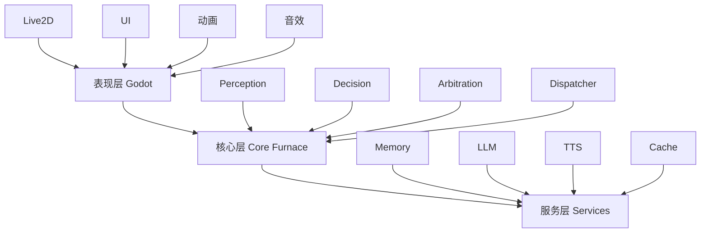

# Marionet（魔法人偶师）

> 智能陪伴向的桌面宠物框架 | AI驱动 | Live2D | 离线可用

[][status] [][csharp] [][godot] [][dotnet] [][license]

!!! warning "项目处于早期原型阶段"
    核心功能尚在开发中

**Marionet** 是一个智能陪伴向的桌面宠物框架。它融合了传统桌宠的离线玩法与现代 AI 增强能力。无需配置AI也可享受完整的陪伴体验：动画互动、日常仪式、好感度养成、记忆收藏。当接入 AI 服务后，桌宠将获得深度对话、视觉理解、情境感知等能力，实现更好的陪伴效果。

项目灵感来自东方Project爱丽丝·玛格特罗依德

## 核心特点

### 陪伴体验

- **日常仪式感** - 了解并学习你的行为，建立专属的相处节奏
- **惊喜与彩蛋** - 随机事件、特殊台词、收藏系统
- **共同活动** - 一起看视频、玩游戏、工作学习
- **可教导成长** - 教她新知识、纠正理解、记录技能
- **好感度养成** - 拥有高级好感系统，体验更加自然

### 技术特性

- **渐进式记忆** - 周回顾、长期记忆、可编辑历史
- **Fast/Slow 双脑** - 快速本地响应，平衡性能与费用消耗
- **环境感知** - 理解你在做什么，采取最佳策略择机互动
- **离线优先** - 核心玩法完全本地化，可自定义功能
- **Live2D表现** - 情绪驱动的自然表情与动作
- **模块化设计** - 按需加载功能，定制自由度高

## 项目状态

**当前阶段**：原型功能设计

### 已完成 ✅
- Live2D 模型渲染（Godot + GDCubism）
- 基础感知层架构，实现环境感知与基础决策输出
- 调用VLM和OCR进行复杂场景识别

### 进行中 🔨
- 整体功能协调规划
- LLM与Godot渲染端同步
- LLM + TTS 流程协调与优化
- 断句与口型同步
- Fast/Slow 双通道响应机制
- 环境感知决策引擎

### 规划中 📋
- 图数据库记忆系统
- 好感度与养成机制
- 用户画像系统

!!! info "完整路线图"
    查看 [ROADMAP.md](roadmap.md) 了解详细开发计划

## 快速开始

### 环境与工具

#### 必需工具

| 工具 | 版本 | 用途 | 下载链接 |
|------|------|------|----------|
| **Godot** | 4.3+ | 渲染引擎与编辑器 | [godotengine.org](https://godotengine.org/download) |
| **GDCubism** | 0.91+ | Live2D渲染依赖 | [MizunagiKB/gd_cubism](https://github.com/MizunagiKB/gd_cubism) |
| **.NET SDK** | 8.0+ | C# 核心逻辑开发 | [dotnet.microsoft.com](https://dotnet.microsoft.com/download) |
| **Git** | 2.40+ | 版本控制 | [git-scm.com](https://git-scm.com/) |

!!! warning "重要"
    必须下载 **Godot Mono 版本**（支持 C#），而非标准版本

#### 推荐工具

| 工具 | 用途 | 说明 |
|------|------|------|
| **Visual Studio 2022** | C# IDE（首选） | 免费 Community 版，Godot 集成好，调试强大 |
| **VS Code / Cursor** | 轻量编辑器 | 需自行配置 C# 插件 + Godot 插件 |

!!! tip "IDE推荐"
    推荐使用 `VS2022`，当然其他的也OK

**VS Code / Cursor 配置**（可选）：
```bash
# 安装必需插件
# - C# (ms-dotnettools.csharp)
# - Godot Tools (geequlim.godot-tools)
# - C# Dev Kit (ms-dotnettools.csdevkit) - 可选

# 注：使用Cursor推荐额外配置本项目的Rules文件
```

### 安装与运行

```bash
# 1. 克隆项目
git clone https://github.com/TLSLime/Marionet
cd Marionet
```

!!! info "详细开发指南"
    查看 [开发指南](development/development.md) 了解详细配置步骤

## 架构概览



### 核心设计原则

1. **离线可用，在线增强** - 核心功能本地实现，AI 为可选增强层
2. **有机融合** - 统一的"感知→决策→表现"框架，避免功能割裂
3. **低侵入高温度** - 智能择机触发，专注模式自动静默
4. **模块化可扩展** - 插件式架构，版本管理与依赖检测

!!! info "详细架构文档"
    查看 [architecture.md](architecture/architecture.md) 了解详细设计

## 技术栈

| 层级 | 技术 | 版本 | 说明 |
|------|------|------|------|
| **渲染引擎** | Godot | 4.3+ | 跨平台、轻量、免费 |
| **Live2D** | GDCubism | latest | 官方 Godot 插件 |
| **核心逻辑** | C# | .NET 8 | 高性能、易维护 |
| **性能关键** | C++ | - | 少量使用，系统优化 |
| **本地 AI** | ONNX Runtime | 1.16+ | 可选本地模型 |
| **云端 AI** | 各厂商 API | - | OpenAI/Claude/DeepSeek 等 |
| **图数据库** | Neo4j | 5.x | 记忆关联存储 |
| **配置/缓存** | SQLite | - | 轻量级本地存储 |
| **语音合成** | TTS | - | 本地 + 云端混合方案 |

### 为什么选 Godot？

- 跨平台：Windows/Linux/Mac 一套代码
- 轻量级：相较于WEB方案打包后文件较小（约100M），可以深度优化
- C# 支持：与 .NET 生态深度集成
- 功能定制友好：可以基于引擎额外开发玩法
- 免费开源：引擎和插件源码开源，实现逻辑明确，可以自定义功能开发

## 核心功能

### 智能对话
自然流畅的对话能力，有个性、会吐槽、能接梗。采用 Fast/Slow 双通道机制，保证即时响应与高质量回复。

→ [详细设计](features/dialogue.md)

### 环境感知与自主行为
实时理解屏幕内容、窗口活动、音频状态，主动做出反应。支持专注模式自动静默。

→ [详细设计](features/environment-aware.md)

### 长期记忆与成长
图数据库存储记忆关联，记住相处的点滴。随着互动增加逐渐"理解"用户。

→ [详细设计](features/memory.md)

### 实时表演与肢体语言
Live2D 驱动的丰富表情与动作，情绪渐变、微表情、口型同步。

→ [详细设计](features/live-performance.md)

### 更多功能
- [用户画像系统](features/user-profile.md) - 多维度行为分析
- [触摸互动](features/touch-interaction.md) - 抚摸/揉捏的养成体验
- [游戏陪玩](features/gaming.md) - 屏幕识别与实时评论（规划中）
- [VTuber 模式](features/streaming.md) - 直播互动支持（规划中）

!!! info "完整功能列表"
    查看 [功能愿景文档](features.md) 了解所有功能

## 项目灵感

### 命名来源
**Marionet** 来自《东方Project》的 **爱丽丝·玛格特罗依德**，她是操纵人偶的魔法使。本项目通过代码与 AI 技术，为虚拟角色注入"生命"。

"Marionet" 源自法语 "marionnette"（牵线木偶），但她不是被动傀儡，而是拥有自主决策的陪伴者。

### 设计理念
受《天降之物》中 **伊卡洛斯** 启发：
- 陪伴者定位：始终守护在用户身边
- 情感温度：从机械程序到温暖与关怀
- 成长机制：通过好感度、记忆积累逐渐"理解"用户

## 贡献指南

欢迎贡献！项目目前处于早期阶段，核心架构还在快速迭代。

### 如何贡献
1. Fork 项目
2. 创建特性分支 (`git checkout -b feature/AmazingFeature`)
3. 提交更改 (`git commit -m 'Add some AmazingFeature'`)
4. 推送到分支 (`git push origin feature/AmazingFeature`)
5. 提交 Pull Request

### 贡献方向
- Bug 修复
- 文档改进
- Live2D 模型适配
- 新的 LLM/TTS 提供商支持
- 游戏适配插件

!!! info "详细贡献指南"
    查看 [CONTRIBUTING.md](CONTRIBUTING.md) 了解详细流程

## 开源协议

### 项目许可

本项目采用 **Apache License 2.0** 开源协议。

**核心框架**（Marionet）采用 Apache 2.0 许可证，可自由用于商业和非商业用途。无论是否使用 Live2D 组件，框架本身的许可证保持不变。

### 组件许可说明

| 组件 | 许可证 | 说明 |
|------|--------|------|
| **Marionet 核心框架** | Apache 2.0 | 本项目原创代码，可自由使用、修改、商业化 |
| **GDCubism 插件（源码）** | MIT | Godot 的 Live2D 插件 |
| **GDCubism 插件（编译后）** | MIT + Live2D | 编译后链接 Live2D SDK |
| **Live2D Cubism SDK** | Live2D 专有 | 用于 Live2D 模型渲染 |
| **Godot Engine** | MIT | 运行时引擎 |

### 重要说明

#### 开发和学习（免费）

- 克隆和构建本项目用于学习、开发、测试 - 完全免费
- 本地运行和调试 - 完全免费
- 修改和自定义功能 - 完全免费

#### 公开分发（需要 Live2D 许可）

如果你想公开分发包含 Live2D 渲染功能的编译后应用：

- **需要获取 Live2D 许可证**
- 免费层级：年收入 < 100 万美元（需注册）
- 付费许可：大型商业项目
- 详情：https://www.live2d.com/

#### 不使用 Live2D（完全自由）

你可以选择：
- 使用框架的其他功能（对话、记忆、感知等）- 仅受 Apache 2.0 约束
- 替换渲染组件为其他方案 - 仅受 Apache 2.0 约束
- 分发不包含 Live2D 的版本 - 仅受 Apache 2.0 约束

### 关于本仓库中的模型文件

本仓库可能包含 Live2D 官方发布的免费开源示例模型，仅用于演示目的。这些模型由 Live2D Inc. 提供，受其开源许可约束。

如需使用自定义模型，请自行准备并遵守相应许可条款。

### 详细许可信息

完整的许可证条款和详细说明：

- **英文版（官方）**：[LICENSE.md](../LICENSE.md)
- **中文版（参考）**：[LICENSE.zh-CN.md](../LICENSE.zh-CN.md)

!!! note "注意"
    中文版为非官方翻译，仅供参考。如有冲突，以英文版为准。

### 快速参考

**可以做什么：**
- 使用、学习、修改本项目
- 在商业项目中使用框架代码（Apache 2.0）
- 开发和测试包含 Live2D 的版本

**需要注意：**
- 公开分发包含 Live2D 的二进制文件需要 Live2D 许可证
- 框架本身（Apache 2.0）的许可不受 Live2D 影响
- 可以选择不使用 Live2D 组件

## 联系方式

- **GitHub Issues**: [提交问题](https://github.com/TLSLime/Marionet/issues)
- **Email**: limesoda0290@gmail.com

## 致谢

- [Godot Engine](https://godotengine.org/) - 优秀的开源游戏引擎
- [GDCubism](https://github.com/MizunagiKB/gd_cubism) - Live2D Godot 插件
- [东方Project](https://touhou-project.news/) - 灵感来源
- 所有贡献者和支持者

---

<p align="center">Crafted with 💖 for digital souls seeking companionship</p>

[status]: https://github.com/TLSLime/Marionet
[csharp]: https://docs.microsoft.com/en-us/dotnet/csharp/
[godot]: https://godotengine.org/
[dotnet]: https://dotnet.microsoft.com/
[license]: https://opensource.org/licenses/Apache-2.0
